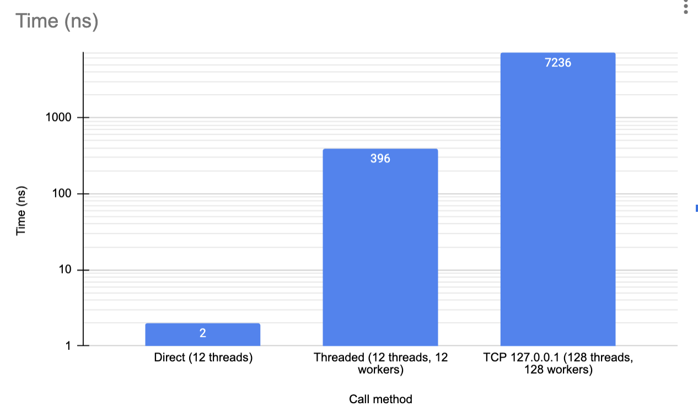

Nano service test lab
---
This is a test system for measuring differences between different ways of calling a function. The purpose
is to mesure the benefits of using the nano service architecture as proposed
by Mattias Andersson.

The test
---

A loop calling a function that just doubles the value passed in is 
used for the test. All values are summed to produce a result. This is
just to make sure the effect of running the function in different ways
result in the same result.

The methods tested are:

Direct

: This is a classic function call in C++. It goes through an interface
so there is a little bit of overhead. It's trivially threaded and
runs in parallel.

Local threaded
: This dispatches the call to multiple threads (from multiple threads)
and pushes values onto a queue to be processed and manages the result.

TCP Network 127.0.0.1
: This starts a server with a service that just accepts a numer on an 
line and returns the double. Without any other protocol or overhead.

Results:
--

| Method   | Time (ns)  |
|----------|------------| 
| Direct   | 2 ns (1.8) |
| Threaded | 374 ns     |
| TCP      | 7235 ns    |

So a nanoservice can offer a speedup of about 200x compared to a thread 
dispatch solution, and 3600x(!) compared to a networked solution.

Note the logarithmic scale in the chart below.

TODO
---
- Compare with a more realistic function that does work too (for a better proportion)
- Add a test that uses HTTP and JSON
- Test with real network code to and from a remote host (and not just loopback)
- Run the test on Linux